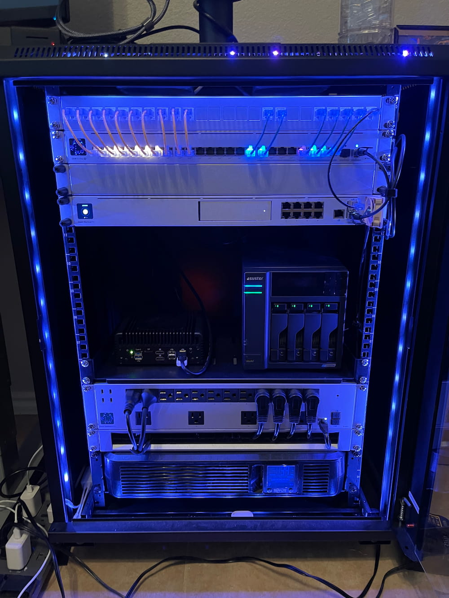
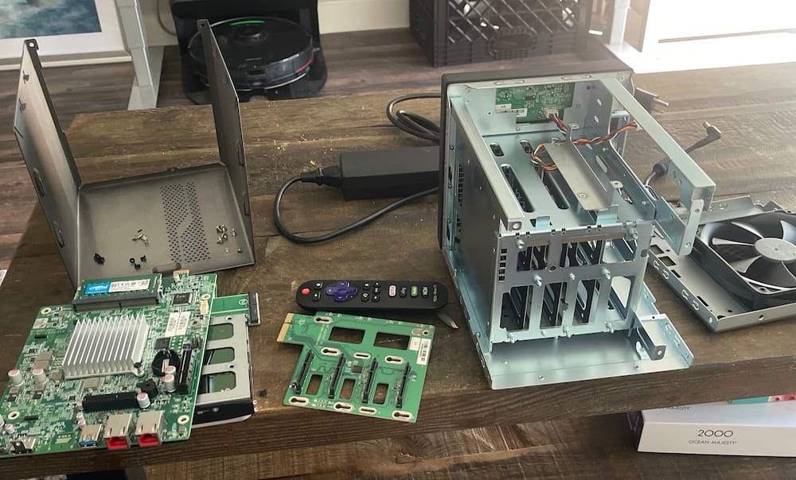
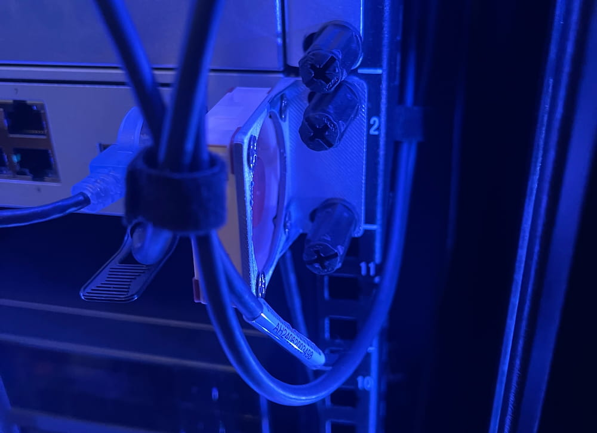

Over time my homelab has turned into a small but capable rack setup. It handles backups, storage, and networking for the house, along with a few personal projects. It’s not over the top, but it’s built for reliability and quiet operation.

The rack includes:
- Unifi 24 Port Patch Panel
- Unifi Pro Max 24 POE 
- Unifi 1U Blank Panel 
- Unifi Dream Machine Pro 
- Asustor 4 bay NAS (4 20TB HDDs, 1TB nvme cache, and 10GB network card)
- CWWK New 12th Gen Firewall Mini PC Intel i3 N100 (32GB RAM and 2TB nvme drive)
- Unifi Power Distribution Pro
- Tripp Lite SMART1500LCD 1500VA UPS
---

## Networking

At the top of the rack is a **Unifi Pro Max 24 PoE** switch and a **24-port patch panel**. They keep everything tidy and power my access points and cameras. There's also a **1U blank panel** just to keep airflow and spacing clean.

Below that is a **Unifi Dream Machine Pro**, which runs my main network. It handles VLANs for IoT, cameras, and guests. It also doubles as my NVR, but I would like to add a dedicated Unifi NVR soon.

The Unifi hardware has been dependable and easy to manage, but most of the interesting work is in the hardware below.

---

## The NAS

Storage runs on an **Asustor 4-bay NAS**. It holds **four 20TB hard drives** in RAID 6, giving about **36TB of usable space**. I use it for backups, media, and Proxmox storage.

I’ve made two upgrades that made a noticeable difference:

- Added a **1TB NVMe cache**, which speeds up small file access and transfers.
- Installed a **10GbE network card**

These upgrades were to get the maximum performance out of this small NAS, but I plan on upgrading to a custom built 10 bay NAS in the future.

---

## The Mini PC

Next to the NAS is a **CWWK 12th Gen Firewall Mini PC** with an **Intel i3 N100**. I upgraded it with **32GB of RAM** and a **2TB NVMe drive**.

It runs **Proxmox VE**, hosting several LXCs and a few lightweight VMs — things like *Sonarr*, *Radarr*, *Cloudflared*, and *NUT monitoring*.  
It stays cool and quiet, uses little power, and has been running continuously for months without issue.

---

## Cooling Mod

One small project that turned out well was a **3D-printed fan mount** next to the Dream Machine Pro.  
It holds a **40mm Noctua fan** aimed directly at the **10Gb SFP+ adapter**, which typically run warm.

The mount keeps the fan secure and out of the way, and it’s quiet enough that I don’t notice it running. Temperatures on the adapter dropped by almost 10*F.

---

## Power

The rack runs through a **Unifi Power Distribution Pro** and a **Tripp Lite SMART1500LCD UPS**.  
This combination lets me monitor power use, control outlets remotely, and gives enough time for a clean shutdown during an outage.

---

## Closing Notes

This setup is a fun way to tinker and improve my networking skills in my downtime. It covers my home networking, backups, and lab needs without drawing much power or making much noise. In the next part of the series, I'll go over all the software running in this rack!